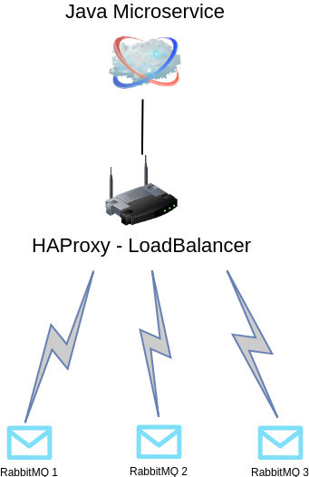

# Broad Message

 This project have 3 RabbitMQ and one HaProxy to loadBalance.




## Getting Started

These instructions will get you and overview of how to configure a RabbitMQ and send some messages.

### Prerequisites

What things you need to run the software:

* Java 8+
* [docker-compose](https://docs.docker.com/compose/)

## Installation

To Start RabbitMQ and HaProxy

```sh
docker-compose up -d
```
java -jar xxxx

## Usage example

To see the RabbitMQ console access:

```sh
http://localhost:8080/#/ -- RabbitMQ1
http://localhost:8081/#/ -- RabbitMQ2
http://localhost:8082/#/ -- RabbitMQ3
```

User: mqadmin

Password: Admin123XX_

To see the HAProxy console access:

```sh
http://localhost:20000/
```

User: admin

Passowrd: admin


## Release History

* 0.0.1
    * Work in progress

## Meta

Renato Serra 

[https://github.com/serrarenato/mensageria](https://github.com/serrarenato/mensageria)

